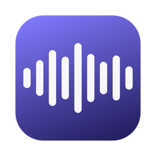

<div align="center">



# Echo Player

**会自己找歌词的 macOS 播放器**

打开一首歌，歌词自己出现；打开一部片，字幕自己浮上来。<br>
没有设置页，没有模型选项，没有"请先下载"——一切都已就位。


**[官网 · 下载 · 安装教程](https://keikajames.github.io/Echo_Player/)**

</div>

---

## 为什么做它

Apple Music 的流动歌词很美，但它只属于曲库里的歌。Echo Player 把这种体验带给**你磁盘上的任何声音**：Demo、现场录音、播客、老歌、字幕组还没动手的片子。它不问你用什么引擎、什么语言、什么模型——就像 Apple Music 从不问你这些。

## 它会做的事

**歌词自己来。** 打开音频的一瞬间，Echo Player 按顺序尝试：同名 `.lrc` 文件 → 本地缓存 → [LRCLIB](https://lrclib.net) 开放曲库（已发行歌曲秒出人工歌词）→ 本机 AI 识别。识别分两步走：系统引擎先流式出草稿，屏幕不空等；Whisper 在后台深入精修，完成后静默替换。全程无需任何操作。

**逐字点亮。** Apple Music 式卡拉 OK 渲染：当前行放大、逐词浮现、自动居中滚动；点任意一行跳转播放，手动翻看 4 秒后自动归位。识别结果可一键导出 LRC（⇧⌘E）。

**光会呼吸。** 窗口边缘是 Apple Intelligence 风格的动态光晕——七色 HSB 漂移、三层呼吸描边，并且**踩在鼓点上**：曲目加载时后台预分析整首歌的拍点网格（谱通量算法，vDSP 加速），播放时零延迟按网格弹跳，还会洒到窗口轮廓之外。视频播放时光晕改用画面边缘的实时氛围色。嫌闹？工具栏 ⋯ 里一键关。

**视频同样体面。** 原生悬浮控制条（QuickTime 手感）、窗口自动贴合视频分辨率（无黑边）、不可避免的留边用模糊画面填充、鼠标停两秒界面自动隐身、字幕自动识别叠加。

**开会它来记。** ⇧⌘K 唤出实时字幕浮窗：边听边转文字，还能**分辨谁在说话**——pyannote 分割 + WeSpeaker 声纹聚类，在场几个人、每人说了什么，一目了然。支持导出记录（.txt）与录音（.wav）。

**格式通吃。**

| 通路 | 格式 |
| --- | --- |
| 原生（AVFoundation） | mp3 · m4a · aac · flac · wav · aiff · caf / mp4 · mov · m4v |
| FFmpeg（KSPlayer） | ogg · oga · opus · ape · wma / mkv · webm · flv · avi · ts |

> FFmpeg 通路走独立解码内核，播放、走带、倍速、音量、系统"正在播放"齐全；
> 拍点光晕与歌词识别暂只覆盖原生通路（见「已知限制」）。

## 开箱即用，也真的离线

- Whisper small 模型（约 465 MB）**内置在安装包里**，说话人分离模型（13 MB）同样内置——首次启动没有任何下载。
- 所有语音识别强制本机执行，**音频从不离开你的 Mac**。
- 唯一的网络请求是向 LRCLIB 查歌词（只发送标题/艺人/时长元数据）和检查更新（GitHub Releases）。没有遥测。

## 快捷键

| 操作 | 快捷键 | 操作 | 快捷键 |
| --- | --- | --- | --- |
| 打开文件/文件夹 | ⌘O | 显示 / 隐藏歌词 | ⌘L |
| 播放 / 暂停 | 空格 | 实时字幕 | ⇧⌘K |
| 上一首 / 下一首 | ⌘← / ⌘→ | 重新识别歌词 | ⇧⌘R |
| 后退 / 前进 10 秒 | ⇧⌘← / ⇧⌘→ | 导出 LRC | ⇧⌘E |
| 音量增 / 减 | ⌘↑ / ⌘↓ | | |

## 构建

```bash
git clone https://github.com/KeikaJames/Echo_Player.git
DEVELOPER_DIR=/Applications/Xcode.app/Contents/Developer \
  xcodebuild -project LyricPlayer.xcodeproj -scheme LyricPlayer -configuration Release build
```

需要 Xcode 26+。首次构建会解析 Swift 包依赖（KSPlayer 的 FFmpeg 二进制较大，耐心几分钟）。

## 自动更新

应用每 24 小时静默检查一次 GitHub Releases（菜单栏「检查更新…」可随时手动触发）。发现新版后**应用内一键更新**：下载 → 与发布说明中的 SHA-256 指纹比对（防篡改/防传错）→ 校验包身份 → 自动替换重启。应用内下载不带隔离标记，更新永远不会再遇到 Gatekeeper。任何一步失败都会退回"打开发布页手动下载"。

**发版流程**：`git tag v1.1 && git push origin v1.1`——[Release 工作流](.github/workflows/release.yml)会自动构建、打包、生成 SHA-256 指纹并发布；官网下载按钮实时指向最新版本，无需改任何页面。

## 反馈

危险的 bug（崩溃/丢数据/隐私疑虑）或任何建议：**gabira@bayagud.com**，每封都会看。

## 架构速览

| 模块 | 职责 |
| --- | --- |
| `Models/EnginePlayer` | AVAudioEngine 播放内核：变速不变调、实时电平 tap |
| `Models/VideoBackend` `FFmpegBackend` | 原生视频 / FFmpeg 双后端，统一 `PlaybackBackend` 协议 |
| `Models/BeatDetector` | 谱通量鼓点检测 + 整曲离线拍点网格（热路径零堆分配） |
| `Transcription/` | 歌词管线：LRCLIB → 系统流式识别 → Whisper 精修；实时字幕 + 说话人分离 |
| `Views/AuroraBackground` | 边缘光晕（移植自 AppleIntelligenceForSwiftUI）与氛围背景 |
| `Views/GlowHalo` | 窗外光环：跟随主窗的透明子窗口 |

## 已知限制

- 纯音乐没有可识别的人声，会如实显示"未识别到语音内容"
- 极端嘈杂或人声极少的音频可能识别不到（会明确提示，不装死）
- FFmpeg 通路格式暂无拍点光晕、氛围采样与歌词自动识别
- 实时字幕跟随系统语言

## 致谢

- [WhisperKit](https://github.com/argmaxinc/WhisperKit)（MIT）— Whisper 的 CoreML 移植
- [FluidAudio](https://github.com/FluidInference/FluidAudio)（Apache-2.0）— 说话人分离
- [KSPlayer](https://github.com/kingslay/KSPlayer) 与 [FFmpegKit](https://github.com/kingslay/FFmpegKit)（GPL-3.0）— 扩展格式解码
- [AppleIntelligenceForSwiftUI](https://github.com/alessiorubicini/AppleIntelligenceForSwiftUI)（MIT）— 光晕结构的移植来源
- [LRCLIB](https://lrclib.net) — 开放的同步歌词库

## 许可

本仓库源码以 **[MIT](LICENSE)** 发布。注意：官方二进制包链接了 GPL-3.0 授权的 KSPlayer/FFmpeg 组件，因此**二进制分发**整体按 GPL-3.0 条款进行（源码公开已满足要求）；若你 fork 后需要纯 MIT 的二进制，移除 KSPlayer 依赖与 `FFmpegBackend.swift`、保留 AVFoundation 通路即可。
