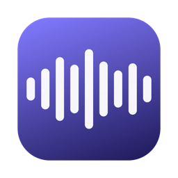

<div align="center">



# Echo Player

**会自己找歌词的 macOS 播放器**

打开一首歌，歌词自己出现；打开一部片，字幕自己浮上来。<br>
没有设置页，没有模型选项，没有"请先下载"——一切都已就位。


**[官网 · 下载 · 安装教程](https://keikajames.github.io/Echo_Player/)**

</div>

---

## 为什么做它

Apple Music 的流动歌词很美，但它只属于曲库里的歌。Echo Player 把这种体验带给**你磁盘上的任何声音**：Demo、现场录音、播客、老歌、字幕组还没动手的片子。它不问你用什么引擎、什么语言、什么模型——就像 Apple Music 从不问你这些。

## 它会做的事

**歌词自己来。** 打开音频的一瞬间，Echo Player 会先找同名 `.lrc` 和本地缓存，再用本机语音模型识别。系统引擎先流式出草稿，Whisper 在后台深入精修，完成后静默替换。需要曲库歌词时，可在「歌词」菜单里打开 [LRCLIB](https://lrclib.net) 查询。

**逐字点亮。** Apple Music 式卡拉 OK 渲染：当前行放大、逐词浮现、自动居中滚动；点任意一行跳转播放，手动翻看 4 秒后自动归位。识别结果可一键导出 LRC（⇧⌘E）。

**光会呼吸。** 窗口边缘是 Apple Intelligence 风格的动态光晕——七色 HSB 漂移、三层呼吸描边，并且**踩在鼓点上**：曲目加载时后台预分析整首歌的拍点网格（谱通量算法，vDSP 加速），播放时零延迟按网格弹跳，还会洒到窗口轮廓之外。视频播放时光晕改用画面边缘的实时氛围色。嫌闹？工具栏 ⋯ 里一键关。

**视频同样体面。** 原生悬浮控制条（QuickTime 手感）、窗口自动贴合视频分辨率（无黑边）、不可避免的留边用模糊画面填充、鼠标停两秒界面自动隐身、字幕自动识别叠加。

**开会它来记。** ⇧⌘K 唤出实时字幕浮窗：边听边转文字，还能**分辨谁在说话**——pyannote 分割 + WeSpeaker 声纹聚类，在场几个人、每人说了什么，一目了然。支持导出记录（.txt）与录音（.wav）。

**系统原生格式。**

| 通路 | 格式 |
| --- | --- |
| AVFoundation | mp3 · m4a · m4b · aac · flac · wav · aiff · caf · ac3 / mp4 · mov · m4v |

## 开箱即用，也真的离线

- 官方安装包内置 Whisper small 模型、tokenizer（约 468 MB）和说话人分离模型（13 MB）；系统语音引擎首次使用某种语言时，macOS 可能安装对应的本地语言资源。
- 语音识别只使用本地可用的引擎；本地模型不可用时直接停止，**音频不会被送去网络识别**。
- 默认网络请求只有 GitHub Releases 更新检查。打开在线歌词后，LRCLIB 只会收到文件内的标题、艺人和时长，不会收到文件名。没有遥测。
- 应用启用了 App Sandbox 和 Hardened Runtime，文件访问范围来自你在打开面板中选择的文件或文件夹。

## 快捷键

| 操作 | 快捷键 | 操作 | 快捷键 |
| --- | --- | --- | --- |
| 打开文件/文件夹 | ⌘O | 显示 / 隐藏歌词 | ⌘L |
| 播放 / 暂停 | 空格 | 实时字幕 | ⇧⌘K |
| 上一首 / 下一首 | ⌘← / ⌘→ | 重新识别歌词 | ⇧⌘R |
| 后退 / 前进 10 秒 | ⇧⌘← / ⇧⌘→ | 导出 LRC | ⇧⌘E |
| 音量增 / 减 | ⌘↑ / ⌘↓ | | |

## 构建

```bash
git clone https://github.com/KeikaJames/Echo_Player.git
DEVELOPER_DIR=/Applications/Xcode.app/Contents/Developer \
  xcodebuild -project LyricPlayer.xcodeproj -scheme LyricPlayer -configuration Release build
```

需要 Xcode 26+。仓库不提交 Whisper 模型和 tokenizer；普通源码构建仍可使用系统本地识别，Release 工作流会把两者的固定版本打进安装包。

## 更新检查

应用每 24 小时检查一次 GitHub Releases（菜单栏「检查更新…」可随时手动触发）。发现新版后会打开项目的 GitHub 发布页，由你手动下载和安装；应用不会在进程内下载、解压或替换自己。

**发版流程**：`git tag v1.1 && git push origin v1.1`——[Release 工作流](.github/workflows/release.yml)会自动构建、打包、生成 SHA-256 指纹并发布；官网下载按钮实时指向最新版本，无需改任何页面。

## 反馈

危险的 bug（崩溃/丢数据/隐私疑虑）或任何建议：**gabira@bayagud.com**，每封都会看。

## 架构速览

| 模块 | 职责 |
| --- | --- |
| `Models/EnginePlayer` | AVAudioEngine 播放内核：变速不变调、实时电平 tap |
| `Models/VideoBackend` | AVFoundation 视频后端，与音频内核共用 `PlaybackBackend` 协议 |
| `Models/BeatDetector` | 谱通量鼓点检测 + 整曲离线拍点网格（热路径零堆分配） |
| `Transcription/` | 歌词管线：本地文件 / 可选 LRCLIB → 系统流式识别 → Whisper 精修；实时字幕 + 说话人分离 |
| `Views/AuroraBackground` | 边缘光晕（移植自 AppleIntelligenceForSwiftUI）与氛围背景 |
| `Views/GlowHalo` | 窗外光环：跟随主窗的透明子窗口 |

## 已知限制

- 纯音乐没有可识别的人声，会如实显示"未识别到语音内容"
- 极端嘈杂或人声极少的音频可能识别不到（会明确提示，不装死）
- 只支持 AVFoundation 能原生解码的音视频格式
- Whisper 深度识别限于 60 分钟以内的音频；更长内容仍会先尝试系统本地识别
- 实时字幕跟随系统语言

## 致谢

- [WhisperKit](https://github.com/argmaxinc/WhisperKit)（MIT）— Whisper 的 CoreML 移植
- [FluidAudio](https://github.com/FluidInference/FluidAudio)（Apache-2.0）— 说话人分离
- [AppleIntelligenceForSwiftUI](https://github.com/alessiorubicini/AppleIntelligenceForSwiftUI)（MIT）— 光晕结构的移植来源
- [LRCLIB](https://lrclib.net) — 开放的同步歌词库

## 许可

本仓库以 **[MIT](LICENSE)** 发布。
